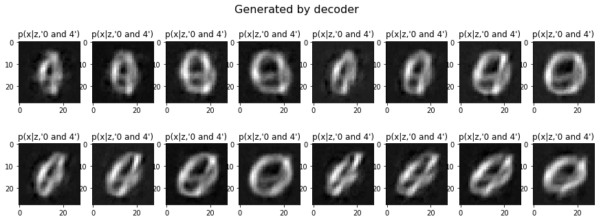
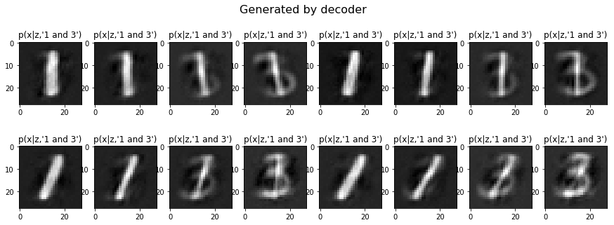
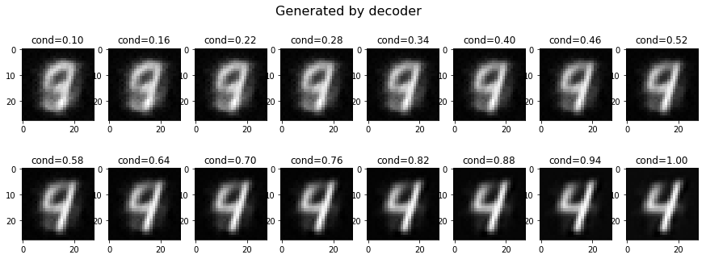

# CVAE
Conditional VAE

See [here](https://bobondemon.github.io/2018/09/18/Variational-Inference-Notes/) for theory part (Only in Mandarin)

# Conditioned Results:

The conditional-generated images:

# Conditioned on Two Labels:

1. Conditioned on '0' and '4'

2. Conditioned on '1' and '3'

# Conditioned with Different Strengh

The condition values are from 0.1 (weak) to 1.0 (strong). Following results are conditioned on '4'

